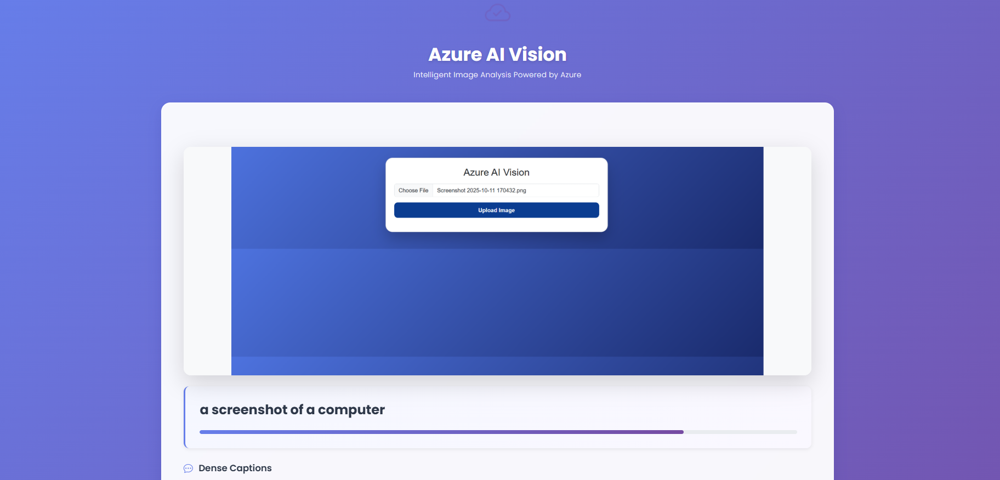

# 🚀 Azure AI Vision Web Application

A modern, full-stack web application for intelligent image analysis using **Azure AI Vision API**.  
Built with Flask, Bootstrap 5, and deployed live on Render.

---

## 🌍 Live Demo

👉 **Production App:**  
https://azure-imagevision.onrender.com  

*(Note: Free tier may take 20–40 seconds to wake up if idle.)*

---

## 📸 Application Preview

### 🏠 Homepage
<p align="center">
  
</p>

---

### 🧠 AI Analysis Results
<p align="center">
  
</p>

## ✨ Features

### 🧠 AI Capabilities
- Image Caption Generation
- Dense Caption Analysis
- Smart Tag Recognition
- Object Detection with Bounding Boxes
- People Detection with Confidence Score

### 🎨 Modern UI
- Glassmorphism Design
- Fully Responsive (Mobile + Desktop)
- Drag & Drop Upload
- Image Preview
- Animated Confidence Progress Bars
- Smooth Transitions & Professional Styling

### 🔐 Security
- API Keys stored securely in environment variables
- `.env` excluded from GitHub
- Production-ready Gunicorn server

---

## 📱 Responsive Design

Works seamlessly on:

- 💻 Desktop  
- 📱 Mobile  
- 📟 Tablet  

---

## 🛠 Tech Stack

| Layer | Technology |
|-------|------------|
| Backend | Flask (Python) |
| AI | Azure AI Vision |
| Frontend | Bootstrap 5 + Custom CSS |
| Server | Gunicorn |
| Hosting | Render |

---

## 📦 Project Structure

```
vision-webapp/
│
├── app.py
├── requirements.txt
├── runtime.txt
├── Procfile
│
├── templates/
│   └── index.html
│
├── static/
│   ├── css/
│   └── uploads/
│
└── README.md
```

---

## ⚙️ Local Development Setup

### 1️⃣ Clone Repository

```bash
git clone https://github.com/mash157/azure-imagevision.git
cd vision-webapp
```

### 2️⃣ Create Virtual Environment

```bash
python -m venv venv
venv\Scripts\activate   # Windows
source venv/bin/activate  # macOS/Linux
```

### 3️⃣ Install Dependencies

```bash
pip install -r requirements.txt
```

### 4️⃣ Create .env File

```
AI_ENDPOINT=https://your-resource.cognitiveservices.azure.com/
AI_KEY=your_api_key
FLASK_ENV=development
```

### 5️⃣ Run App

```bash
python app.py
```

Visit:
```
http://localhost:5000
```

---

## 🚀 Deployment (Render)

This application is deployed on Render using:

```
gunicorn app:app
```

Environment variables are securely configured in Render dashboard.

---

## 📡 API Endpoint

### POST /analyze

Returns:

```json
{
  "caption": "Sample caption",
  "captionConfidence": 95.4,
  "tags": [...],
  "objectCount": 3,
  "peopleCount": 1
}
```

---

## 🔥 Highlights

✔ Cloud deployed  
✔ Secure API key handling  
✔ Production WSGI server  
✔ Mobile responsive UI  
✔ Real-time AI predictions  

---

## 🧠 Azure AI Vision Documentation

- https://learn.microsoft.com/en-us/azure/ai-services/computer-vision/

---

## 📄 License

Educational and development use.

---

**Developed by Mash157 🚀**